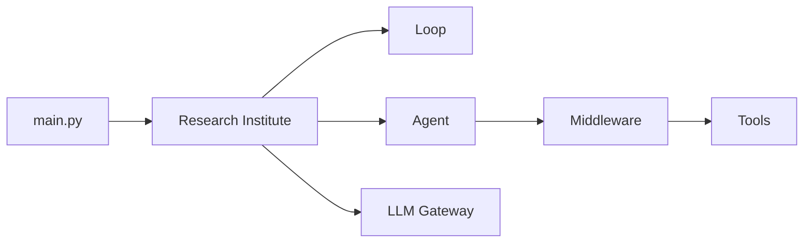

# CureForge System Overview

## 1.1 What This Codebase Is

CureForge is an autonomous biomedical research agent system built on LangGraph that iteratively cycles through four research phases (Research, Hypothesize, Test, Synthesize) to discover potential cures for diseases. The system runs independent research agents for multiple diseases concurrently, each with persistent SQLite checkpoint memory.

## 1.2 Tech Stack

### Runtime Environment

- **Python**: >=3.13 (per pyproject.toml)
- **Framework**: FastAPI 0.136.0, Uvicorn 0.44.0
- **Agent Framework**: LangChain 1.2.15, LangGraph 1.1.6, langgraph-checkpoint-sqlite 3.0.3

### LLM Integration

- **Gateway**: litellm >=1.83.0 (proxy layer at port 4000)
- **Providers**: OpenAI-compatible API via litellm, supporting Ollama, Groq, Cerebras, Gemini
- **Supported Models**: ollama/gemma4, ollama/qwen3.5:397b-cloud, groq/llama-3.1-8b-instant, cerebras/llama3.1-8b, gemini/gemini-2.5-flash

### Data & Storage

- **SQLite**: Checkpointer for agent state persistence
- **Redis**: 7-alpine (external service for rate limiting, cache)
- **File Cache**: .cache/ directory for logs, agent DBs, playground outputs
- **Input**: .input/ directory for research/simulations data

### Testing & DevOps

- **Testing**: pytest 9.0.2, pytest-asyncio 1.3.0, pytest-cov 7.1.0, fakeredis 2.35.1
- **Linting**: ruff >=0.15.11
- **Orchestration**: Docker Compose with cureforge, redis, litellm services

## 1.3 High-Level Architecture

## 1.4 Data Flow

1. **Entry**: `run_demo()` in main.py seeds diseases list and selects model
2. **Institute**: Creates AutonomousResearchInstitute with model_name and max_workers
3. **Agent Creation**: For each disease, create_base_agent():
    - Loads LLM via litellm proxy
    - Opens SQLite checkpointer at `.cache/agent_dbs/agent_{id}_memory.db`
    - Composes agent with tools and middleware
4. **Loop Execution**: run_autonomous_research_loop():
    - Initial invoke with "Begin autonomous cure research..."
    - Iterates up to max_iterations, checking should_stop flag
    - Each iteration: agent.invoke() with continue prompt
5. **Phase Transitions**: Via transition_phase tool:
    - Summarizes context using LLM
    - Validates transition is allowed per PHASE_TRANSITIONS
    - Updates current_phase in state
6. **Artifacts**: Summaries saved to `.cache/playground/{agent_id}/summaries/`

## 1.5 Phase Pipeline

| Phase       | Goal               | Entry Tools                                                         | Exit Criteria                | Possible Next             |
| ----------- | ------------------ | ------------------------------------------------------------------- | ---------------------------- | ------------------------- |
| Research    | Gather evidence    | research_scan_literature, fetch_paper_from_link                     | Can form testable hypothesis | Hypothesize               |
| Hypothesize | Propose mechanisms | hypothesize_propose_mechanism, hypothesize_rank_mechanism           | Hypothesis is testable       | Test or Research          |
| Test        | Run simulations    | test_run_in_silico_trial, test_run_safety_screen                    | Evidence supports synthesis  | Synthesize or Hypothesize |
| Synthesize  | Summarize findings | synthesize_generate_candidate_summary, synthesize_define_next_steps | Conclude cycle               | Research (restart)        |

## 1.6 Critical Dependencies

- **litellm**: Must be healthy (port 4000) before cureforge starts - health check in compose.yml
- **redis**: Must be healthy - handles litellm rate limiting and cache
- **Ollama models**: Must be running on host.docker.internal:11434 for local models
- **API Keys**: groq, cerebras, gemini keys must be valid for external providers
